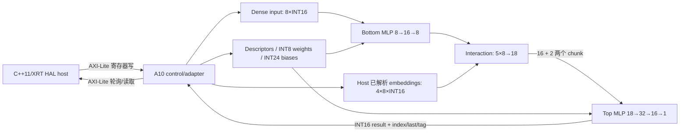

# F37X DLRM FPGA 项目恢复审计报告

审计日期：2026-08-17

审计范围：仅 `D:\FpgaWork\f37x_dlrm_rtl` 本地仓库

审计性质：只读基线恢复与下一步规划；未修改 RTL/TB/脚本/约束，未导入 bundle，未运行服务器或板卡，未提交

## 1. 结论摘要

项目不是“只有 10%”的初始状态。MLP、定点量化、特征交互、AXI-Lite 控制、内部 Bottom→Interaction→Top 串接以及早期 F37X 板卡验证都已经形成较多成果；但当前仓库存在明显的“代码进度领先于 Git 与原始证据归档”的问题。若以完整 DLRM FPGA 数据通路为目标，最大的未完成部分仍是 FPGA 侧 embedding lookup、真实 HBM/DDR 数据通路、DMA/batch 输入、硬件周期计数器，以及完整 implementation/xclbin/板卡证据闭环。

当前恢复判断如下：

| 项目 | 审计结论 |
|---|---|
| 当前分支 | `work/stage2n-fpga-interaction` |
| 当前 HEAD | `802573d8b9b0da01539007b23d312f7cd3e16f43`（`fix(f37x): shorten Stage 2N-A3 compute-unit name`） |
| 当前本地已提交基线 | `802573d`。这是当前分支实际可见的最后提交，不包含 A5–A12 的未跟踪实现。 |
| 最近可恢复的验证候选 | bundle 中的 `a73e04587b184edf975205fdc3de35c254f55384`（Stage 2N-A6）。bundle 完整性已验证，但尚未导入当前 Git 对象库，不能称为当前 HEAD。 |
| 最近可恢复的板卡验证快照 | bundle 中的 `f8dbbd8a4574e10030fa8178daef8a7fca3a4242`（Stage 2N-A4）。本地返回状态记录了 MLP 与 18 个 interaction 输出精确通过。 |
| 工作树 | 审计开始时无已跟踪文件修改或删除，有 111 个非忽略未跟踪文件，其中约 104 个与 Stage 2N 相关；本轮仅新增本报告和检查清单，因此结束时为 113 个。原有 111 个文件均保持原样。 |
| 远端同步状态 | 当前仓库无 remote、当前分支无 upstream，无法判断是否领先/落后服务器或远端仓库。 |
| 服务器实时状态 | 受仓库规则限制，未访问服务器，无法确认服务器当前目录、进程或最新产物。 |
| A11 | 实现、资产生成器、host 与验收说明存在，但均未提交，且本地没有对应原始状态/日志/CSV；不能确认“256/256 板卡通过”已经完成证据闭环。 |
| A12 | 性能 host、runner、collector 与总结说明存在，但均未提交，原始日志/状态/CSV不在本地；只能视为待复核的历史结果，不能视为最终提交。 |
| A13 | 未发现 A13 文件或 RTL 周期计数器实现，判定为未开始。 |

因此，当前最合理的动作不是继续直接改 RTL，而是先把 A4/A5/A6 bundle 与 A7–A12 未跟踪树恢复成可审查、可追溯的小提交，再开展 A13。

## 2. 审计依据与证据等级

本报告采用以下边界，避免把说明文档等同于实测证据：

- **已提交**：对象存在于当前本地 Git 历史。
- **可恢复且有原始证据**：本地存在完整、可校验的 Git bundle，并有相应 status/log/hash 记录；尚未导入不等于当前已提交。
- **未跟踪实现**：源码或脚本存在于工作树，但没有进入当前历史。
- **文档声称**：数字只出现在未跟踪 Markdown 中，缺少本地原始 status/log/CSV/xclbin hash；需要复跑或取回原始证据。

关键本地证据：

- `server_results/stage2n_a4/stage2n_a4_board_pass.bundle`：完整 bundle，HEAD `f8dbbd8...`。
- `server_results/stage2n_a5/stage2n_a5_internal_pipeline_xsim_pass.bundle`：完整 bundle，HEAD `915a49b...`；A5 四个本地未跟踪源文件的 SHA-256 与状态文件记录一致。
- `server_results/stage2n_a6/stage2n_a6_internal_timing_pass.bundle`：完整 bundle，HEAD `a73e045...`，sidecar SHA-256 一致。
- `server_results/dlrm_f37x_rtl_kernel_stage2n_a2.xclbin`：42,305,493 字节，记录的 SHA-256 为 `d89f5a...`，本地 hash 验证记录通过。
- 本地未发现 A7–A12 对应的原始 `status/log/CSV` 证据目录，也未发现 `docs/evidence` 或可归档的 A11/A12 build 结果。

## 3. Git 与文档一致性

### 3.1 当前历史

当前分支最近的 Stage 2N 提交为：

```text
802573d fix(f37x): shorten Stage 2N-A3 compute-unit name
3c8730e stage2n: add A3 F37X hardware link flow
5fdacc0 fix(stage2n): correct A2 XO packager paths
4b3beaa fix(stage2n): resolve A2 XSim runner sources
1643b49 stage2n: integrate MLP and interaction register window
47e35f1 cleanup(stage2n): remove obsolete interaction engine
e68f692 test(stage2n): add interaction v2 regression
89288a9 stage2n: add standalone feature interaction engine
b3fc997 stage2m: add trained hybrid DLRM flow
39aa325 stage2l: add trained quantized classifier package
```

本地 Git 身份为 `管鹏飞 <gpengfei623@163.com>`。仓库没有 remote 配置，因此无法通过 `git status` 或 `git fetch` 推断服务器分支状态。

### 3.2 基线分层

建议长期把基线分成三层记录：

1. **当前可安全 checkout 的本地提交基线：`802573d`**

   包含 Stage 2N A1–A3 的提交历史，但不包含当前未跟踪的自动流水实现。
2. **最先进的可恢复验证候选：`a73e045`（A6 bundle）**

   bundle 可校验、包含 A5/A6 来源；需用户确认后导入为独立 recovery ref，再比较，不能在当前脏工作树直接 checkout。
3. **A7–A12 恢复现场**

   111 个未跟踪文件中的大部分属于该阶段。其内容具有工程价值，但提交来源、版本选择和原始运行证据尚未闭环。

`README.md`、`host/README.md`、`docs/CURRENT_STATE.md` 和 `AGENTS.md` 中部分边界仍停留在更早阶段。例如 `host/README.md` 仍称没有 host 实现，但仓库已经提交了 Stage 2J–2M 的 XRT HAL host。恢复时需要专门处理这种文档漂移，但本轮没有改动这些已有文件。

## 4. 已形成的模块与验证状态

### 4.1 已提交并有历史基础

- 参数化定点 MLP：INT16 activation、INT8 weight、INT24 bias、ACC32/ACC48 路径，具备 rounding、saturation、ReLU 和 ready/valid/backpressure 语义。
- Stage 2C/2D 的 banked weight、bias 与 activation memory，以及 100 MHz 量化流水时序收敛基础。
- Stage 2M 训练/量化包：Bottom MLP `8→16→8`，4 个 embedding table，Top MLP `18→32→16→1`，256 个合成测试样本。
- 独立 feature interaction：5 个 8 维向量，输出 bottom dense 8 个值加 10 个两两 dot product，共 18 个 INT16 输出。
- Stage 2N A2 AXI-Lite register-window 集成和 A3 XO/xclbin link 脚本。

### 4.2 可恢复且有本地返回证据

- **A4 板卡 smoke**：设备 index 2、BDF `0000:9b:00.1`；MLP 结果 `19`，18 个 interaction 输出逐项精确匹配；存在 stale-done 恢复和 firewall/CU idle 检查记录。该证据对应 bundle 快照 `f8dbbd8...`。
- **A5 内部流水 XSim**：Bottom 8、interaction 18、Top 最终 `-60`；连续 2 次运行；包含 12 周期 backpressure；对应 bundle 快照 `915a49b...`。
- **A6 内部 OOC 时序候选**：目标 `xcvu37p-fsvh2892-2L-e`、100 MHz；说明记录 setup WNS `+1.482 ns`、unrouted 0、latch 0、DRC error 0、LUT 7156、FF 3553、RAMB18 49、RAMB36 0、DSP 17。148 条负 hold 路径均到 OOC 输出端口，内部 register-to-register hold failure 为 0。该结论只适用于内部 OOC 边界，不等同于完整 F37X implementation。

### 4.3 未跟踪的恢复现场

未跟踪文件包含：

- A5 segmented MLP controller 和内部 DLRM pipeline controller；
- A6 XDC、OOC/timing/hold 诊断脚本；
- A7 AXI-Lite 自动 pipeline top/adapter/TB；
- A8 XO/xclbin packager/link/accept 脚本；
- A9/A10 板卡 smoke、capacity expansion 与证据收集脚本；
- A11 batch asset builder 与 real-model batch host；
- A12 performance host、runner、collector 与报告。

这些文件没有零字节文件，但存在多个 `v1/v2/v3/v4` 修订版本。恢复前必须按证据和调用链选择最终版本，不能简单地把全部未跟踪文件一次性加入提交。

## 5. 当前真实数据通路

### 5.1 已提交 A2 路径

A2 kernel 是 AXI-Lite 控制路径，将 MLP 与独立 interaction engine 放在同一个寄存器窗口内。它不是自动执行完整 DLRM 的流水，也没有外部内存主接口。

### 5.2 未跟踪 A10 自动流水路径

恢复现场中最完整的自动数据路径如下：



内部 controller 通过状态机完成 Bottom、embedding 装载、interaction、Top 输入分块和最终完成；Top 阶段的 result ready/valid 受 host POP/结果寄存器反压控制。`done` 是 core 侧脉冲，adapter 将其锁存为 host 可见状态。该架构已经体现了单卡、单样本、串行自动流水，但尚未形成 HBM/DMA batch 数据面。

## 6. Embedding 的真实实现方式

当前存在三种不同层次，不能混称为“FPGA embedding lookup”：

1. **早期 RTL 模型**：`embedding_mem_model` 使用同步本地数组，默认 `32×8` INT8，可用 `$readmemh` 初始化；这是仿真/小规模本地存储模型，不是 HBM。
2. **已提交 Stage 2M hybrid flow**：模型包内含 4 张 embedding 表，行数分别为 `64/80/96/128`，embedding dim 为 8。categorical ID lookup 和 integer interaction 由 CPU host 完成，FPGA 只运行 Bottom/Top MLP。
3. **未跟踪 A10/A11 自动流水**：asset/host 仍在 CPU 端根据 categorical IDs 解析出 4 个 embedding vector，然后逐个通过 AXI-Lite 写入。RTL 中仅有 `embedding_mem[0:3]`，每项保存 `8×INT16=128 bit` 的当前样本向量；它是样本暂存寄存器阵列，不是表查询引擎。

结论：当前项目已经有 embedding 数据参与 DLRM 计算，但**没有 FPGA 侧 categorical-ID lookup，也没有可扩展 embedding table 存储/访问通路**。

## 7. HBM/DDR 与主机数据搬运状态

当前 kernel top 仅暴露 `ap_clk`、`ap_rst_n` 和 32-bit AXI-Lite control（12-bit address），没有 `m_axi` 端口。link 脚本只有 `--connectivity.nk`，没有 `--connectivity.sp` 或 `sp=...:HBM[x]` 映射；host 使用 `xclRegRead/xclRegWrite`，没有 `xrt::bo`、`xclAllocBO`、`xclMapBO`、`xclSyncBO` 或 OpenCL buffer 路径。

A4 runner 对 HBM[0] 为空、DMA 计数器不变的检查是安全护栏，恰好证明当前设计没有使用 HBM。A8 文档中空 CONNECTIVITY 也与“control-only kernel”一致。

因此以下项目均未实现：

- 单 HBM bank embedding table；
- 多 HBM bank channel mapping；
- kernel `m_axi` read master；
- host BO 分配、bank placement 和 DMA；
- categorical ID batch 请求与返回；
- request coalescing/scheduling 的 RTL 接入。

## 8. A11、A12、A13 判定

### A11：有实现现场，但不能确认验收完成

A11 的 asset builder、host、runner、collector 和最终验收说明均存在。说明声称使用 `F37XPB1 v2`、256 个确定性样本，每样本写入 5 个 descriptors、1360 个 weights、73 个 biases 和 4 个已解析 embedding vectors，并取得 256/256 bit-exact、228/256 classification correct。

但这些文件全部未跟踪，本地没有对应原始 status/log/CSV，也没有 A11 bundle 或 commit。因此这些数字应标注为“未跟踪文档声称，待原始证据复核”，不能写成已完成板卡验收。

### A12：性能采集实现存在，但尚未形成可靠基线

A12 host 记录以下阶段：`PREPARE_IDLE`、`INPUT_PROGRAM`、`START_ISSUE`、`WAIT_VALID`、`RESULT_READ`、`RETIRE`、`TOTAL`。未跟踪最终说明声称：

- exact：5120/5120；classification correct：4560；
- static config：7313.764 us；
- mean：188.742 us；p50：186.516 us；p95：194.725 us；p99：200.276 us；
- 基于 mean 的吞吐：5298.240 samples/s；wall throughput：5137.275 samples/s；
- input fraction：0.250797；wait fraction：0.575195；control fraction：0.165751。

按上述文档数字可推导 mean 内约为：input program `47.336 us`、wait valid `108.563 us`、prepare/start/result-read/retire 合计 `31.284 us`，另有约 `1.558 us` 未被这三个 fraction 覆盖。这里是**由未验证汇总值推导**，不是新的测量结果；没有原始 CSV 时也不能进一步可靠分离 result-read 与 retire。

尤其要注意，`WAIT_VALID` 是 host 轮询寄存器所见的时间，包含 host/device/control-path 开销，并不等于纯 RTL pipeline cycle 数。因此 A12 不能代替硬件周期计数器。

### A13：未开始

仓库中未发现 A13 命名文件，也未在 RTL/host/scripts 中发现 Bottom、Interaction、Top 或 total 的硬件 cycle counter 寄存器。A13 应在恢复并固化 A10–A12 后启动，建议至少锁存：

- Bottom MLP 运行周期；
- pipeline 内 embedding/input handoff 周期（必须先定义是否包含 host AXI-Lite programming）；
- interaction 周期；
- Top MLP 运行周期；
- core start 到最终 result accepted 的总周期；
- 可选的 backpressure/stall 周期。

计数器的起止事件、是否包含等待 host POP、溢出方式和读取一致性必须先写成寄存器契约，再改 RTL。

## 9. 性能基线与证据边界

目前能在本地原始证据中确认的是功能正确性、A5 XSim backpressure 和 A6 内部 OOC 时序；没有本地原始性能 CSV 可以构成可复现的 board performance baseline。

A12 文档中的 `188.742 us / 5298.240 samples/s` 可作为恢复线索和复跑验收目标，但不能用于论文、专利或最终性能对比，直至：

1. 找回或重新生成原始 status/log/CSV；
2. 记录 xclbin SHA-256、UUID、设备/BDF、平台、XRT/Vivado 版本和时钟；
3. 固化 warmup、sample count、统计定义和异常样本处理；
4. 由 A13 计数器拆分纯 RTL 周期与 AXI-Lite/host 开销；
5. 将同一模型、同一 batch 和同一定点结果与 CPU/GPU 基线比较。

完整 implementation/place-and-route、自动 pipeline 的可追溯 xclbin、F37X/VU37P 复跑以及真实板卡验证，在本轮均未执行或确认。

## 10. 主要风险

| 风险 | 影响 | 恢复措施 |
|---|---|---|
| 111 个未跟踪文件混有多个修订版 | 易误选旧版、漏文件或把失败方案提交为最终版 | 先建文件清单与 SHA-256，再按 A5→A12 分批审查和提交 |
| 当前 HEAD 与 A6 bundle/A10 工作树断裂 | 难以证明来源与增量 | 导入 bundle 到独立 recovery ref，做对象级 diff，不在当前现场直接 checkout |
| A11/A12 只有未跟踪总结 | 无法证明板卡结果与性能数值 | 取回原始 evidence，或由用户按固定 runner 复跑 |
| host/README 与 CURRENT_STATE 漂移 | 容易错误判断项目阶段 | 恢复提交后统一更新状态、决策与风险记录 |
| 没有硬件 cycle counter | host 延迟无法拆分纯 RTL 与控制开销 | A13 先定义事件边界，再加只读锁存计数器 |
| embedding 仍由 CPU lookup | 不能宣称完整 FPGA DLRM 或 HBM embedding 加速 | A14 从单 HBM bank、只读 lookup、bit-exact 验证开始 |
| control-only AXI-Lite 输入 | 单样本 programming 开销高，无法代表批处理吞吐 | HBM 基线稳定后再引入 BO/DMA/batch |
| A6 是内部 OOC 边界 | 不能代表完整 xclbin implementation 时序 | 由用户提供完整 link/implementation 报告和板卡日志 |

## 11. 推荐恢复顺序

### Recovery-1：保护现场（不改 RTL）

1. 生成 111 个未跟踪文件的路径、大小、SHA-256 清单。
2. 将当前 `git status`、HEAD、Git identity 和 bundle 校验结果归档。
3. 不清理、不重命名、不运行会覆盖结果目录的 runner。

### Recovery-2：导入可恢复历史（不 checkout 当前现场）

1. 用户确认后，把 A4/A5/A6 bundle 导入独立 `recovery/stage2n-*` refs。
2. 验证 `f8dbbd8`、`915a49b`、`a73e045` 的父链和 tree。
3. 用 Git 对象级 diff 对照当前未跟踪 A5/A6 文件，确认来源。

### Recovery-3：分阶段固化 A7–A12

1. 按 A7 kernel integration、A8 build/link、A9/A10 capacity/board、A11 batch、A12 performance 分组。
2. 每组只保留被最终 runner 实际引用的版本；历史修复文档可以保留，但不能把失败版误作入口。
3. 每组执行 `git diff --check`、源文件清单、可用的本地 Python/静态检查；需要 Vivado/F37X 的项目只生成并审查验证包，由用户执行。
4. 原始证据缺失的 A11/A12 标为待复跑，不能用 Markdown 自证通过。

### Recovery-4：A13 硬件周期计数

在恢复树 clean、A10/A11 功能基线可复现后，再以小提交加入计数器寄存器、独立 TB、host 读取和结果 schema。优先做到不改变数值数据通路和 ready/valid 行为。

### Recovery-5：A14 单 bank HBM embedding

先实现一条最小、可验证的 `m_axi` 只读路径：host BO 写表、categorical IDs 输入、FPGA lookup、单 HBM bank 映射、bit-exact 输出和带 hash 的证据。单 bank 稳定后再讨论多 bank、coalescing、scheduler 和 batch；不要在恢复阶段直接做大规模重构。

## 12. 需要用户明确确认后才能执行的修改

本轮没有执行下列动作。继续前需要用户明确授权具体项：

- 导入 A4/A5/A6 bundle 到本地 Git refs；
- 为当前 111 个未跟踪文件生成并保存 SHA-256 清单；
- 选择 A7–A12 最终版本、`git add`、创建恢复提交或新分支；
- 修改已有 `README.md`、`docs/CURRENT_STATE.md`、`docs/DECISIONS.md`、`docs/RISK_REGISTER.md`；
- 运行可能生成/覆盖本地仿真或综合产物的回归；
- 开始 A13 RTL/寄存器/TB/host 修改；
- 开始 A14 `m_axi`/HBM/BO/DMA 修改；
- 任何服务器、xclbin、F37X/VU37P 或板卡操作。

按仓库规则，Codex 不访问服务器、网络或板卡；即使未来需要板卡验证，也只能在用户明确授权并由用户侧执行后，根据用户返回的日志形成结论。未经原始日志支持，不会宣称 F37X 验证成功。
