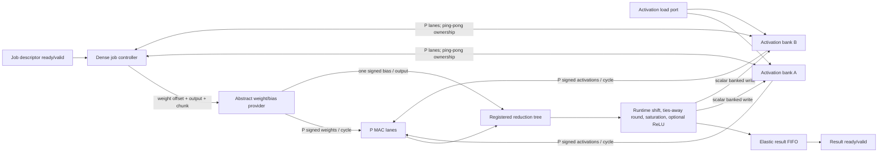

# Parameterized vector PE architecture v1

## 1. Approval and scope

The Stage-2 architecture review is **conditionally approved** against GATE-1
approval commit `37c3990c0973b52910debac35a854e0c2bc875a1`.  Scheme B, a
parameterized multi-cycle vector PE, is the approved implementation direction.
Stage 2A may implement the non-overlapped baseline described here.  The later
final-scope decision D-020 retains Stage 2B output-neuron MAC/reduction overlap
only as an optional performance optimization; it is no longer a GATE-2
prerequisite.

The compute path remains synthesizable SystemVerilog-2012.  This approval does
not authorize HLS, HBM, AXI, a Vitis RTL Kernel, full DLRM, embedding-table
expansion, multilayer scheduling, request deduplication, or dynamic microbatch
scheduling.  The phase-1 RTL, testbenches, fixed-point v0 contract, and external
top-level interface remain unchanged; Stage 2A is an independent hierarchy.

## 2. Approved parameters and invariants

| Item | Approved v1 decision |
|---|---|
| Architecture | Scheme B: vector PE, one output neuron active at a time |
| `NUM_PE` | Default 16; required configurations 4, 8, 16, and 32 |
| `MAX_IN_DIM`, `MAX_OUT_DIM` | Parameterized; default 1024 and 1024 |
| Runtime dimensions | `1..MAX_IN_DIM` and `1..MAX_OUT_DIM` |
| Data widths | Parameterized; preserve current signed input/weight/bias/output formats |
| `ACC_WIDTH` | Parameterized; default 48, phase-1 compatibility mode 32 |
| Arithmetic order | bias alignment, complete accumulation, shift/round, saturation, optional ReLU |
| Activation storage | Two whole-vector ping-pong buffers, each `MAX_DIM` elements |
| Activation banking | `bank=i%NUM_PE`, `address=i/NUM_PE` |
| Weights | Abstract local provider, `NUM_PE*WEIGHT_WIDTH` bits per accepted chunk |
| Bias | Abstract provider, one signed bias per output neuron |
| Backpressure | Ready/valid on job, provider response, and result boundaries |
| Performance point | 250 MHz only for modeling; not a timing claim |

P=16 is a development default, not a paper or final-device configuration.
P=4/8/16/32 must later be synthesized for the exact VU37P target before any
resource, packing, frequency, or final-parallelism conclusion is made.  In
particular, no claim is made that a 48-bit accumulator maps wholly into a DSP.

## 3. Compared architectures

### Scheme A: serial or small MAC array

Scheme A uses one to four multipliers and requires `ceil(D/P)` accepted MAC
chunks for each of O outputs.  Its first-order layer latency is
`O*(ceil(D/P)+ceil(log2(P))+Q)` cycles.  It has the smallest multiplier and
provider-width requirements, the simplest controller, and is useful as a
conservative hardware baseline.  It does not offer sufficient throughput as
the sole architecture for the 256-to-128 and 512-to-256 review layers.

### Scheme B: parameterized vector PE array — approved

Scheme B has P signed multiplier lanes and P lane-local accumulators.  Chunk k
contains features `k*P .. k*P+P-1`.  The final chunk carries a lane mask; a
masked lane must not consume an out-of-range activation or weight and must not
change its partial sum.  `D<P` is legal.

The P lane sums feed a balanced registered reduction tree.  Bias is
sign-extended to `ACC_WIDTH` and is added exactly once before output
quantization.  One output neuron completes before Stage 2A starts the next.

Stage 2A baseline:

```text
K = ceil(D/P)
R = ceil(log2(P))
C_output_baseline = K + R + Q
C_layer_baseline  = O * C_output_baseline
```

Stage 2B target:

```text
C_layer_overlap ~= O*K + R + Q
```

Stage 2B requires two lane-partial-sum register banks: one bank enters the
registered reduction tree while the other starts the next output neuron.  Tags,
capacity accounting, and ordering assertions are required.  Stage 2A must not
silently implement or claim this overlap.

### Scheme C: two-dimensional input/output PE array

Scheme C uses `P_IN*P_OUT` multipliers, broadcasts each input lane to multiple
output-neuron lanes, and consumes
`P_IN*P_OUT*WEIGHT_WIDTH` provider bits per MAC cycle.  Although its ideal
latency scales with `ceil(O/P_OUT)`, it adds wide weight banking, replicated
partial sums, output masks/reordering, high-fanout input routing, and higher
timing risk.  It remains a possible later enhancement only after Scheme B has
real synthesis and utilization evidence.

| Property | Scheme A | Scheme B | Scheme C |
|---|---:|---:|---:|
| Typical multipliers | 1-4 | P = 4/8/16/32 | `P_IN*P_OUT` |
| Outputs accumulated concurrently | 1 | 1 in v1 | `P_OUT` |
| Weight words per cycle | P | P | `P_IN*P_OUT` |
| Tail handling | one input mask | one input mask | input and output masks |
| Control complexity | Low | Moderate | High |
| Routing/timing risk | Low | Moderate | High |
| Role | Baseline | **Approved first implementation** | Deferred enhancement |

## 4. Stage 2A datapath



The weight/bias provider boundary is the future HBM replacement boundary.  The
PE hierarchy sees only logical offsets, chunk indices, lane masks, and
ready/valid payloads.  AXI addresses, burst size, channel ID, and HBM topology
must remain outside it.

### Per-output sequence

1. Request and latch the output neuron's bias.
2. Clear P lane sums, seeding the aligned bias exactly once.
3. For k from zero to K-1, join one activation chunk and one weight chunk.
4. Update lane sums only when the joined chunk is accepted.
5. Apply the tail mask on the final chunk.
6. Transfer the P stable lane sums through R registered reduction stages.
7. Apply the descriptor's output shift, existing ties-away rounding and signed
   saturation, then ReLU when enabled.
8. Enqueue the indexed result and write it to the selected output buffer using
   the same modulo/divide bank mapping.
9. Start the next output only after the non-overlapped context is retired.

Provider starvation holds addresses, counters, masks, and partial sums.  Result
backpressure holds result payload and valid.  A one-entry elastic boundary uses
the replacement condition `ready = !valid || downstream_ready` where its local
state permits same-edge consume/replace.

## 5. Ping-pong activation cache

Each physical buffer stores up to `max(MAX_IN_DIM,MAX_OUT_DIM)` signed elements.
For logical feature i:

```text
bank(i)    = i % NUM_PE
address(i) = i / NUM_PE
```

Thus a chunk address returns P consecutive logical features.  For D not
divisible by P, only `D-P*floor(D/P)` lanes of the final word are valid.  For
`D<P`, chunk zero is the only word and its mask contains D low valid lanes.

The accepted descriptor names distinct input and output buffers.  The input
buffer remains read-owned for the whole job; the output buffer remains
write-owned until all O results have been committed.  A later layer may swap
the selectors only after job completion.  Loading or writing a buffer that is
still owned by the active job is rejected or stalled, never allowed to overwrite
live activations.

At the default maximum and INT16 activations, each buffer is 2048 bytes and the
pair is 4096 bytes before memory-primitive padding.  With P=16 each bank is 64
elements deep.  These are logical capacities, not a BRAM-mapping claim.

## 6. Runtime descriptor

The task-level descriptor contains at least:

```text
in_dim, out_dim,
input_buffer_select, output_buffer_select,
weight_offset, bias_offset,
output_shift, relu_enable
```

Once accepted it is copied into internal registers and remains immutable until
job completion.  A zero or out-of-range dimension, equal input/output buffer
selectors, or unsupported shift must be rejected or complete with an explicit
error status.  No partial output is permitted for an invalid descriptor.

## 7. Arithmetic policy

The external formats and binary-point positions are unchanged.  ACC32 mode
preserves phase-1 signed two's-complement wrap after each addition.  ACC48 mode
sign-extends products and bias and retains the mathematical sum through the
reviewed dimensions.  Widening the integer container does not change the eight
fractional product/bias bits.

The operation order is frozen for Stage 2A:

```text
signed products -> ACC_WIDTH accumulation including aligned bias
                -> runtime arithmetic right shift with ties away from zero
                -> signed INT16 saturation
                -> optional ReLU
```

Layer-specific shifts are carried by the descriptor, while the Stage-1
compatibility configuration uses shift four and ReLU enabled.  The draft
fixed-point v1 rules and unresolved model-level approval are recorded in
`docs/fixed_point_spec_v1_draft.md`; v0 is not modified.

## 8. Batch and supply behavior

Stage 2A accepts one job/sample context at a time.  Batch B therefore multiplies
compute cycles and provider traffic by B; without provider-side weight reuse,
steady-state sample throughput does not improve.  Batching may later amortize
external weight fetch or descriptor overhead, but dynamic microbatch scheduling
is explicitly out of scope.

To avoid PE idling, the abstract provider should support at least one P-weight
chunk per accepted MAC cycle and an elastic response.  If it cannot, ready/valid
backpressure makes the loss explicit as starvation cycles.  Prefetch and
provider-side tiling are later optimizations; Stage 2A correctness must not
depend on uninterrupted supply.

## 9. Approval boundaries still requiring humans

1. Final P after P=4/8/16/32 Vivado synthesis, placement, timing, and resource
   comparison on the exact target.
2. Final adoption of ACC48 for a trained model, including trained range and
   accuracy evidence; ACC32 remains the compatibility mode.
3. Per-layer `output_shift` and ReLU settings for the formal multilayer model.
4. Optional Stage 2B double-psum overlap microarchitecture and its own evidence.
5. Provider-side cache/tile policy and the later physical HBM/AXI boundary.

None of these open decisions blocks the bounded Stage 2A baseline, but Stage 2A
must stop at real Vivado 2020.2/XSim validation and must not claim GATE-2.
